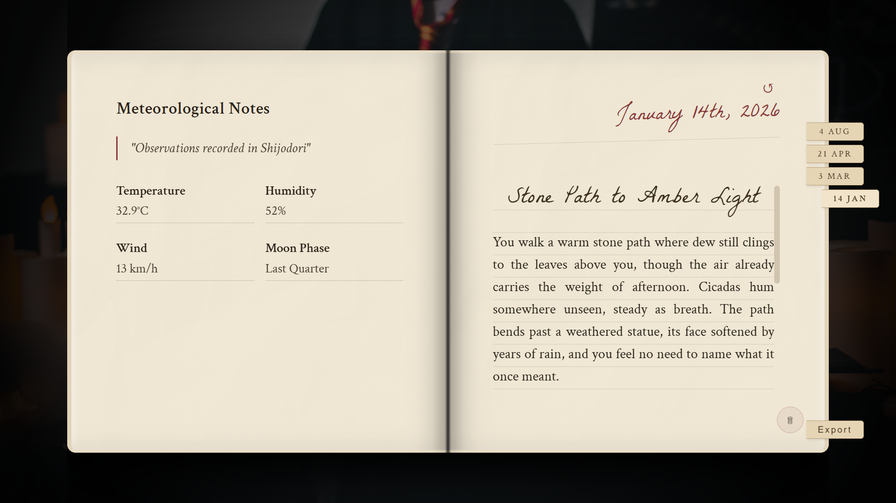
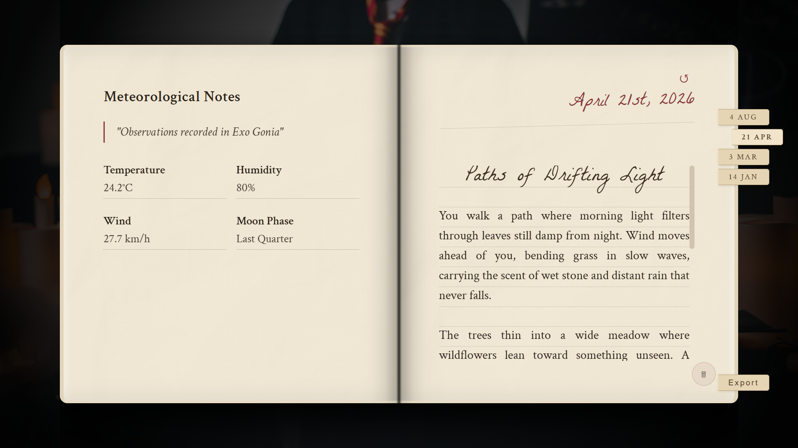
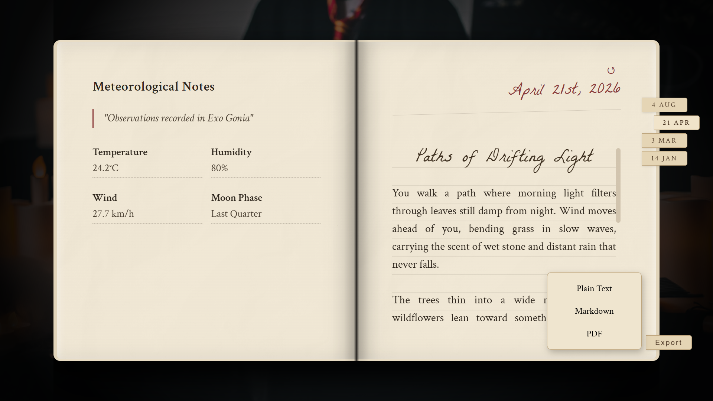
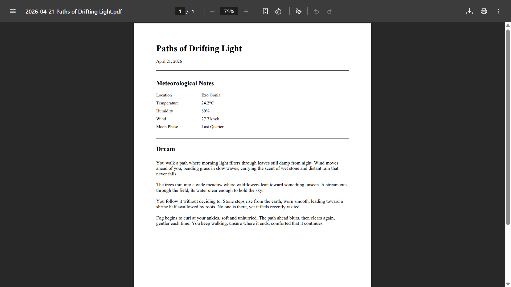

# Dream Journal

A weather driven journal that transforms real weather conditions into short dream narratives
Each dream is influenced by a custom interpretation engine before being generated by an AI model, allowing the atmosphere and emotions and scenery to reflect the present weather conditions

## Preview

### Dream Journal





### Export Options



### PDF Export



# Features

- Weather based dream generation
- custom weather interpretation engine
- journal history stored locally
- journals of previous days accessible by UI
- export to text file, markdown and PDF
- delete journal entries
- return to today shortcut
- Atmospheric loading experience

# Tech Stack

### Frontend

- HTML5
- CSS
- JavaScript

### Backend

- Node.js
- Express.js

### Services

- Weather API
- HackClub API
- LocalStorage

## Instructions

1. Clone this repository

```bash
git clone https://github.com/Prajwal-747/weatherJournal
```

2. Open terminal in project folder

3. install dependencies

```bash
npm install
```

4. open the `.env.example` file in the project directory and replace the placeholders with the API keys from the respective providers.
5. save and then rename the `.env.example` file to `.env`
6. start the server

```bash
node server.js
```

6. open http://localhost:3000
